# Learning Playwright Fundamentals 2x

A hands-on starter project for learning [Playwright](https://playwright.dev/) end-to-end testing with TypeScript. Part of **The Testing Academy** Playwright Fundamentals course.

## Tech Stack

- [Playwright Test](https://playwright.dev/docs/intro) `^1.61.1`
- TypeScript / Node.js (`@types/node`)

## Prerequisites

- [Node.js](https://nodejs.org/) 18+ (LTS recommended)
- npm (ships with Node)

## Getting Started

```bash
# 1. Install dependencies
npm install

# 2. Install Playwright browsers
npx playwright install

# 3. Set up credentials (needed for module 04's session-storage lab)
cp .env.example .env
# then edit .env and add your own VWO_USER / VWO_PASS
```

## Running Tests

```bash
# Run all tests (headed, per playwright.config.ts)
npx playwright test

# Explicitly run in headed mode (watch the browser)
npx playwright test --headed

# Run a single spec
npx playwright test tests/example.spec.ts

# Run in UI mode (interactive)
npx playwright test --ui

# Debug a test
npx playwright test --debug
```

## Viewing the Report

This repo ships a custom TTA HTML reporter (see module 05). After a run:

```bash
# Newest run (index.html always redirects to the latest report)
open tta-report/index.html

# Every past run, newest first
open tta-report/history.html
```

The report updates live *while* tests run — leave it open in a browser tab and it refreshes every 5s.

## Project Structure

```
.
├── tests/
│   ├── 01_Basics/                    # Test anatomy, annotations (skip/only/fail/slow)
│   ├── 02_First_tests/               # Browser → Context → Page (BCP) hierarchy
│   ├── 03_Locators_Commands/         # Lazy locators, strict mode, auto-wait, built-ins
│   ├── 04_Session_Storage/           # storageState: log in once, reuse the session
│   ├── 05_Allure_Reporting/          # Custom TTA HTML reporter + test.step
│   ├── 06_Multiple_Element_/         # allInnerTexts / all() loops, getByTestId
│   ├── 07_WebTables/                 # Dynamic XPath, filter()/:has() row targeting, pagination
│   ├── 08_Web_Select_Frames_Iframe/  # Native, custom, multi-select, tag-style & async dropdowns
│   ├── 09_Frame_Iframe/              # frameLocator, nested iframes, enumerating //frame
│   ├── 10_Keyboard_Hover_Drag_Drop/  # keyboard API, hover menus, drag & drop, right-click
│   ├── 11_JS_Alerts/                 # alert / confirm / prompt dialog handling
│   ├── 12_… … 23_Advance_Framework/  # Remaining curriculum modules (scaffolded, WIP)
│   ├── Template.spec.ts              # Empty spec scaffold, copy for new tests
│   └── example.spec.ts               # Sample: title check + "Get started" navigation
├── utils/
│   └── CustomReporter.ts   # Custom TTA HTML reporter (implements Playwright's Reporter)
├── playwright.config.ts    # Playwright configuration
├── .env.example            # Template for VWO_USER / VWO_PASS — copy to .env
├── package.json
└── .gitignore
```

> **Secrets:** `.env` and `user-session.json` are gitignored. Copy `.env.example` to `.env` and add your own VWO credentials before running module 04.

## What's Inside

`tests/example.spec.ts` demonstrates two core patterns:

1. **Assertions** — verify the page title matches `/Playwright/`.
2. **Navigation + role locators** — click the *Get started* link and assert the *Installation* heading is visible.

### 01 - Test Anatomy & Annotations

**Concept:** every Playwright spec is `test(name, async ({ page }) => {...})`: `page` is a fixture, injected fresh per test, not something you create. Annotations (`.skip`, `.only`, `.fail`, `.slow`) tag a test's execution mode without touching its body.

**Why:** during dev you constantly need to isolate one test (`.only`), silence a broken one (`.skip`), or flag a known-fail (`.fail`), without commenting code out.

**Q&A: why use this?**
- **Q: What breaks if `test.only` ships to CI?** A: Every other test in that run gets skipped, most CI configs (`forbidOnly: !!process.env.CI`) fail the build to catch this.
- **Q: `.skip` vs `.fail`?** A: `.skip` never runs the test. `.fail` runs it and expects a failure, flips to an error if it unexpectedly passes.
- **Q: Can I skip conditionally?** A: Yes, `test.skip(condition, reason)` inside the test body, e.g. skip only on `firefox`.

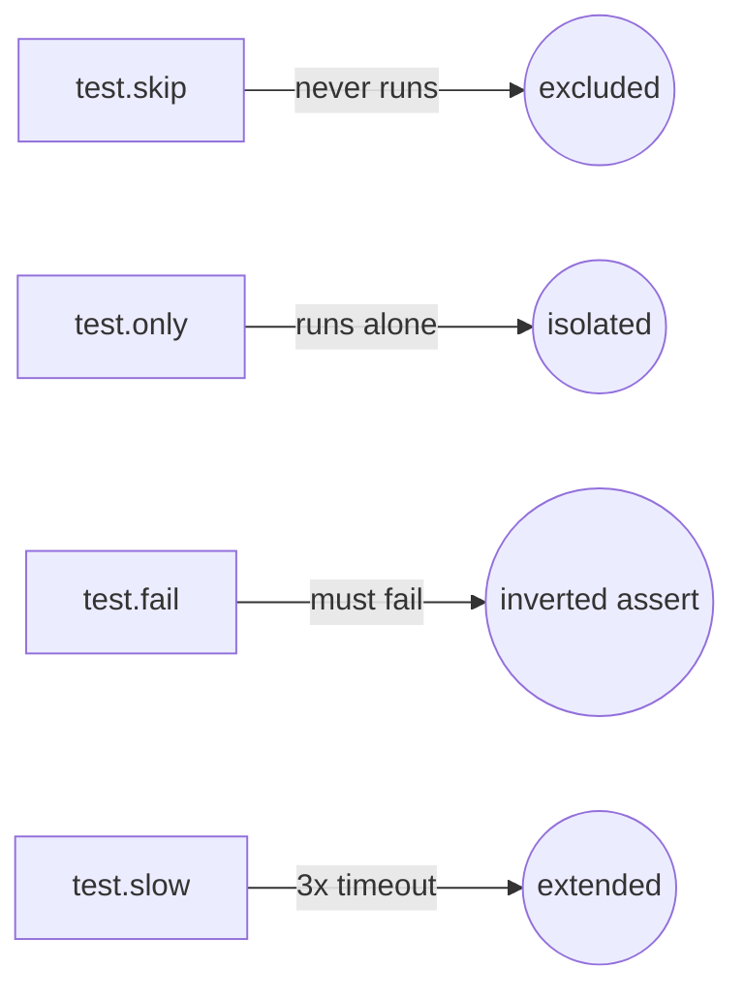

```ts
// Conditional skip, reads browserName from the fixture
test('conditional', async ({ page, browserName }) => {
    test.skip(browserName === 'firefox', 'Not supported in Firefox');
});
```

### 02 - Browser, Context, Page (BCP) Hierarchy

**Concept:** Playwright models automation in three nested layers: one **Browser** process, many **Contexts** (isolated sessions, like separate incognito windows), each with many **Pages** (tabs). Cookies/storage never leak across contexts; pages in the same context share them.

**Why:** testing multi-user flows (admin + guest, two logged-in accounts) needs real session isolation, launching a whole new browser per user is wasteful; a new context is cheap and isolated.

**Q&A: why use this?**
- **Q: When do I need a second context instead of a second page?** A: When the two sessions must NOT share cookies/auth, e.g. admin vs. viewer logged in simultaneously.
- **Q: Does the `test()` fixture give me a context for free?** A: Yes, `{ page }` already comes with its own context. Use `{ browser }` when a test needs to spin up *extra* contexts manually.
- **Q: What's the cleanup order?** A: Reverse of creation: close pages, then contexts, then the browser.

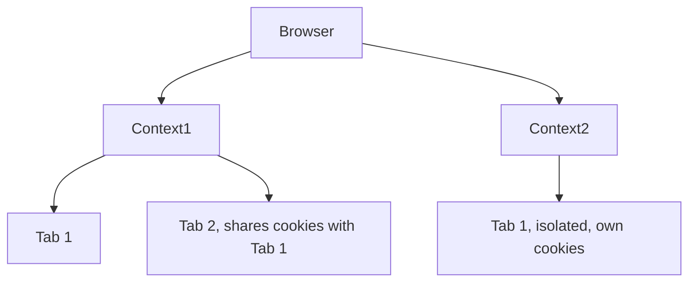

```ts
test("two users interact", async ({ browser }) => {
    const adminContext = await browser.newContext();
    const adminPage = await adminContext.newPage();

    const guestContext = await browser.newContext();
    const guestPage = await guestContext.newPage();

    await adminPage.goto("https://app.vwo.com/#login");
    await guestPage.goto("https://app.vwo.com/#dashboard/home");

    await adminContext.close();
    await guestContext.close();
});
```

Context options (`viewport`, `locale`, `timezoneId`, `geolocation`, or a full device profile like `userAgent` + `isMobile` for mobile emulation) are passed into `browser.newContext({...})`, see [`237_BCP_Test_Options.spec.ts`](tests/02_First_tests/237_BCP_Test_Options.spec.ts).

### 03 - Locators & Commands

**Concept:** a locator (`page.locator(...)`) does not find the element immediately, it is a lazy, re-queryable reference. Playwright resolves it fresh at action time and auto-waits (strict mode: exactly one match, or it throws) until the element is actionable.

**Why:** DOM elements re-render (React/Vue re-mount, AJAX swaps content); a locator that re-queries on every action survives that churn, unlike a one-time `document.querySelector` handle.

**Q&A: why use this?**
- **Q: What is "strict mode"?** A: `locator()` throws if a selector resolves to more than one element, forcing you to narrow the selector instead of silently acting on the first match.
- **Q: CSS selector cheat sheet?** A: `#id` for id, `.class` for className, `[name="value"]` for the name attribute, bare `tag` for a tag selector.
- **Q: Why does `.fill()` succeed without a manual wait?** A: Auto-wait, Playwright polls the element until visible, enabled, and stable before firing the action.

```mermaid
flowchart LR
    A[page.locator&#40;selector&#41;] -->|lazy, no DOM query yet| B{Action called: .fill&#40;&#41;, .click&#40;&#41;}
    B --> C[Resolve selector now]
    C --> D{Strict mode: 1 match?}
    D -->|No| E[Throw]
    D -->|Yes| F[Auto-wait: visible, enabled, stable]
    F --> G[Perform action]
```

```ts
test("TC#1 - Verify VWO login error with lazy, strict, and auto-wait", async ({ page }) => {
    await page.goto("https://app.vwo.com/#login");

    const userNameField = page.locator('#login-username');
    const passwordField = page.locator("#login-password");
    const loginButton = page.locator("#js-login-btn");

    await userNameField.fill("admin@admin.com");
    await passwordField.fill("pass123");
    await loginButton.click();

    const error_message = page.locator('#js-notification-box-msg');
    await expect(error_message).toContainText("Your email, password, IP address or location did not match");
});
```

#### 03.1 - Built-in Locators (`getByRole` / `getByText`)

**Concept:** instead of CSS/XPath, Playwright ships user-facing locators that find elements the way a human or screen reader does: `getByRole`, `getByText`, `getByLabel`, `getByPlaceholder`, `getByTestId`, `getByAltText`, `getByTitle`. `getByRole` targets the accessibility role (button, textbox, checkbox) plus its accessible name.

**Why:** role/text locators survive CSS refactors and hashed class names (e.g. VWO's `C(--common-color-red) invalid-reason`), because they bind to what the user sees, not to brittle markup.

**Q&A: why use this?**
- **Q: When `getByRole` vs `getByText`?** A: `getByRole` for interactive controls (button, textbox, link, checkbox); `getByText` for plain, non-interactive content like a `<div>` error message with no ARIA role.
- **Q: Why does a bare `<div>` resist `getByRole`?** A: It resolves to the `generic` role with no accessible name, so there's nothing stable to target, `getByText` matches its visible text instead.
- **Q: How do I make an error assertion robust?** A: Prefer `getByTestId('email-error')` if devs add `data-testid`; otherwise `getByText(...)`, never the hashed CSS class.

```mermaid
flowchart TD
    Q{Element interactive?} -->|Yes| R["getByRole&#40;'textbox', {name}&#41;"]
    Q -->|No, plain text| T["getByText&#40;'...'&#41;"]
    Q -->|Has data-testid| D["getByTestId&#40;'...'&#41;"]
    R --> A[Action or assert]
    T --> A
    D --> A
```

```ts
test("signup error via built-in locators", async ({ page }) => {
    await page.goto("https://vwo.com/free-trial/");
    await page.getByRole('textbox', { name: "email" }).fill("abcd");
    await page.getByRole('checkbox').check();
    await page.getByRole('button', { name: "Create a Free Trial Account" }).click();

    // Plain <div> error: no role, match the visible text
    await expect(
        page.getByText('The email address you entered is incorrect.')
    ).toBeVisible();
});
```

#### 03.2 - Navigation Options (`waitUntil`, `referer`)

**Concept:** `page.goto(url, options)` controls *when* the call resolves via `waitUntil`: `commit` (server responded) → `domcontentloaded` (HTML parsed) → `load` (default, all resources) → `networkidle` (no requests for 500ms). `referer` sets the `Referer` header so the server thinks the user arrived from a given page.

**Why:** waiting for full `load`/`networkidle` on a heavy SPA wastes seconds when your assertion only needs the DOM, dialing `waitUntil` down speeds tests; `referer` reproduces analytics/attribution flows.

**Q&A: why use this?**
- **Q: What's the default?** A: `load`, Playwright waits for the `load` event (images, CSS, scripts) before `goto` resolves.
- **Q: When use `domcontentloaded`?** A: When you only need parsed HTML and will `await` your own locator afterwards anyway, auto-wait covers the rest.
- **Q: Why is `networkidle` discouraged?** A: It's flaky on pages with polling/websockets that never go idle, prefer web-first assertions over `networkidle`.

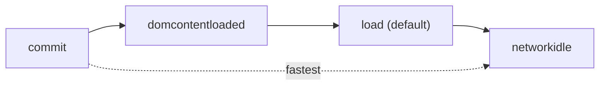

```ts
test("goto with waitUntil + referer", async ({ page }) => {
    await page.goto("https://app.com/page2", { waitUntil: "domcontentloaded" });
    await page.goto("https://app.com/landing", {
        referer: "https://google.com/search?q=testing+academy"
    });
});
```

#### 03.3 - Typing Char-by-Char (`pressSequentially`) & History

**Concept:** `fill()` sets an input's value in one shot; `pressSequentially(text, { delay })` types character by character, firing real `keydown`/`keyup` per key. `page.goBack()` / `page.goForward()` drive browser history.

**Why:** some inputs only react to real key events, autocomplete dropdowns, input masks, key-listeners, where `fill()` is too instant to trigger them.

**Q&A: why use this?**
- **Q: `fill` vs `pressSequentially`?** A: Use `fill` by default (fast, reliable); reach for `pressSequentially` only when the UI needs per-keystroke events.
- **Q: What does `delay` do?** A: Milliseconds between keystrokes, mimics human typing so debounced handlers/suggestions fire.
- **Q: How do I go back a page?** A: `await page.goBack()`, returns a response for the previous history entry (or null if none).

```mermaid
flowchart LR
    A["fill&#40;text&#41;"] -->|one shot, sets value| V[Value set]
    B["pressSequentially&#40;text, {delay}&#41;"] -->|key by key| K[keydown/keyup per char]
    K --> E[Triggers autocomplete / masks]
```

```ts
test("type key-by-key then navigate history", async ({ page }) => {
    await page.goto("https://awesomeqa.com/practice.html");
    await page.locator('[name="firstname"]')
        .pressSequentially("the testing academy", { delay: 200 });

    await page.goto("https://app.vwo.com/login");
    await page.goBack();
});
```

### 04 - Session Storage (Log In Once)

**Concept:** `context.storageState({ path })` snapshots cookies + localStorage to a JSON file after a real login. Any later test loads it with `test.use({ storageState: "./user-session.json" })` and starts already authenticated, skipping the login UI entirely.

**Why:** driving the login form in every test is slow (3-5s each), brittle (a selector change breaks the whole suite), and tests nothing new after the first run.

**Q&A: why use this?**
- **Q: Why does my saved session come back empty?** A: You snapshotted before login finished. Wait for the post-login URL (`await page.waitForURL(/#\/(dashboard|home)/)`) *then* call `storageState`.
- **Q: Where do the credentials go?** A: `.env` (gitignored), read via `dotenv`. Never hardcode them — this repo is public, and pushed secrets live in git history forever.
- **Q: Does the session expire?** A: Yes. It's a real auth cookie with a real TTL — re-run `247_SessionStorage.spec.ts` to refresh it, and never commit the JSON.

```mermaid
flowchart LR
    A["247: saveSession&#40;&#41;"] -->|real login, once| B[waitForURL: dashboard]
    B --> C["storageState&#40;{path}&#41;"]
    C --> D[(user-session.json)]
    D -->|test.use| E["248 / 249: goto dashboard"]
    E --> F((No login form))
```

```ts
// Step 1 — save the session once (reads creds from .env, never hardcoded)
await page.fill("#login-username", process.env.VWO_USER!);
await page.fill("#login-password", process.env.VWO_PASS!);
await page.click("#js-login-btn");
await page.waitForURL(/#\/(dashboard|home)/, { timeout: 15000 });
await context.storageState({ path: "./user-session.json" });

// Step 2 — every later spec starts logged in
test.use({ storageState: "./user-session.json" });

test("go directly to dashboard — no login", async ({ page }) => {
    await page.goto("https://app.wingify.com/#/dashboard/get-started?accountId=1227004");
    await expect(page).toHaveURL(/dashboard/);
});
```

### 05 - Custom Reporter & Test Steps

**Concept:** a reporter is a class implementing Playwright's `Reporter` interface — `onBegin`, `onTestBegin`, `onStepEnd`, `onTestEnd`, `onEnd`. Playwright calls these hooks as the run happens; what you build from them is yours. [`utils/CustomReporter.ts`](utils/CustomReporter.ts) writes a live-refreshing TTA-branded HTML report with per-step screenshots, videos, traces, and console logs.

**Why:** the built-in HTML reporter is generic. A custom reporter puts *your* branding, priority filters, and per-step evidence in front of stakeholders who will never open a CLI.

**Q&A: why use this?**
- **Q: How does the reporter know my steps?** A: `test.step("...")` fires `onStepBegin`/`onStepEnd`. No steps in the spec = a flat, useless report. The steps *are* the report.
- **Q: How do screenshots land inside the right step?** A: Attach with a `step-<index>-` prefixed name (`testInfo.attach("step-0-loaded", ...)`); the reporter matches that prefix to the step index.
- **Q: Why did both tests show the same video?** A: A real bug this module fixes — `testCounter` was incremented in `onTestBegin` but read in `onTestEnd`. Under `fullyParallel`, both tests begin before either ends, so both read the same index and overwrote each other's artifacts. Snapshot the index per test at begin.

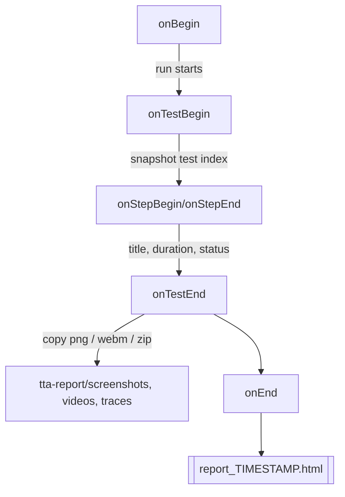

```ts
// playwright.config.ts — point Playwright at the class
reporter: [["line"], ["./utils/CustomReporter.ts"]],

// The spec: steps + prefixed attachments feed the reporter's hooks
test("go directly to dashboard — no login @P0 @smoke", async ({ page }, testInfo) => {
    await test.step("Open VWO dashboard using saved session", async () => {
        await page.goto("https://app.wingify.com/#/dashboard/get-started?accountId=1227004");
        await testInfo.attach("step-0-dashboard-loaded", {
            body: await page.screenshot(),
            contentType: "image/png",
        });
    });

    await test.step("Verify dashboard URL loaded", async () => {
        await expect(page).toHaveURL(/dashboard/);
    });
});
```

Open the result at `tta-report/index.html` (always redirects to the newest run); `tta-report/history.html` lists every past run. `@P0` / `@smoke` tags in the test title drive the report's Priority column and filters.

| | Built-in HTML | Allure | Custom TTA Reporter |
|:--|:--|:--|:--|
| Setup | zero | extra dep + CLI | one file you own |
| Branding | none | limited | total |
| Live during run | no | no | yes (auto-refresh) |
| Best for | daily local dev | large teams, history trends | stakeholder demos, courses |

### 06 - Handling Multiple Elements

**Concept:** when a selector matches many elements, `.allInnerTexts()` returns a `string[]` of every match's text and `.all()` returns a `Locator[]` you can loop over. Iterate, test each, then act on the one you want, or skip the loop entirely and target a unique `data-testid`.

**Why:** lists, nav menus, and result sets have repeated markup (`a.list-group-item` × N). A bare `getByText`/`getByRole` hits strict-mode (>1 match) and throws, so you either narrow to a unique attribute or fan out over the collection.

**Q&A: why use this?**
- **Q: `allInnerTexts()` vs `all()`?** A: `allInnerTexts()` gives you the text values (`string[]`) for reading/filtering; `all()` gives you the `Locator[]` when you need to act (`.click()`, `.getAttribute()`) on each element.
- **Q: Loop match still throws "strict mode violation" — why?** A: `getByText(linkText)` can itself match many nodes; chain `.first()` to pin one, or better, use a unique `getByTestId`.
- **Q: When skip the loop entirely?** A: The moment devs expose a stable `data-testid` — `getByTestId('forgotten-password-link').click()` is one line and can't drift.

```mermaid
flowchart TD
    Q{Element uniquely identifiable?} -->|Yes, data-testid| D["getByTestId&#40;'...'&#41;.click&#40;&#41;"]
    Q -->|No, repeated markup| L["locator&#40;'a.list-group-item'&#41;"]
    L --> T["allInnerTexts&#40;&#41; → string[]"]
    L --> A["all&#40;&#41; → Locator[]"]
    T -->|filter for target| C["getByText&#40;t&#41;.first&#40;&#41;.click&#40;&#41;"]
    A -->|per element| G["getAttribute&#40;'href'&#41;"]
```

```ts
await page.goto("https://app.thetestingacademy.com/playwright/multiple_element_filter");

// Read every link's text
const texts: string[] = await page.locator("a.list-group-item").allInnerTexts();
for (const linkText of texts) {
    if (linkText === "Forgotten Password") {
        await page.getByText(linkText).first().click();   // .first() avoids strict-mode throw
    }
}

// Or act on each Locator directly
for (const link of await page.locator('a.list-group-item').all()) {
    console.log(await link.getAttribute("href"));
}

// Cleanest when a testid exists — no loop at all
await page.getByTestId('forgotten-password-link').click();
```

### 07 - Web Tables (Dynamic Extraction)

**Concept:** an HTML `<table>` is a grid of `tr` rows and `td` cells. Two ways to walk it: build a **dynamic XPath** per cell (`.../tr[i]/td[j]`) inside a nested loop, or use Playwright's `.nth(i)` on a row locator and pull each row's cells with `.allInnerTexts()`.

**Why:** table data is positional and often dynamic (row order changes, new rows appear). Hardcoding `tr[5]/td[2]` breaks the moment the data shifts, so you compute the path or index at runtime and search by content.

**Q&A: why use this?**
- **Q: Dynamic XPath vs `.nth()`?** A: XPath string-building shines when you need axis tricks like `following-sibling::td` (jump from the matched cell to its neighbour); `.nth()` + `allInnerTexts()` is cleaner for reading a whole row as an array.
- **Q: Why start the row loop at `i = 2`?** A: `tr[1]` is the header row; data begins at `tr[2]`. XPath is 1-indexed, unlike `.nth()` which is 0-indexed.
- **Q: How do I grab a value in the same row as a match?** A: Find the cell by text, then hop sideways with `${cellPath}/following-sibling::td` instead of guessing the column index.

```mermaid
flowchart TD
    S[Locate table] --> R["count&#40;&#41; rows &amp; cols"]
    R --> L{Loop i=2..rows, j=1..cols}
    L --> P["build XPath tr[i]/td[j]"]
    P --> M{cell text matches target?}
    M -->|Yes| F["following-sibling::td → related value"]
    M -->|No| L
```

```ts
await page.goto("https://awesomeqa.com/webtable.html");

const rows = await page.locator("//table[@id='customers']/tbody/tr").count();
const cols = await page.locator("//table[@id='customers']/tbody/tr[2]/td").count();

for (let i = 2; i <= rows; i++) {          // tr[1] = header, data from tr[2]
    for (let j = 1; j <= cols; j++) {
        const cell = `//table[@id='customers']/tbody/tr[${i}]/td[${j}]`;
        const data = await page.locator(cell).innerText();
        if (data.includes('Helen Bennett')) {
            const country = await page.locator(`${cell}/following-sibling::td`).innerText();
            console.log(`Helen Bennett is In - ${country}`);
        }
    }
}

// Structured alternative: read each row as a string[] via .nth()
const rowLoc = page.locator('table[summary="Sample Table"] tbody tr');
for (let i = 0; i < await rowLoc.count(); i++) {
    console.log(`Row ${i + 1}:`, await rowLoc.nth(i).locator('td').allInnerTexts());
}
```

#### 07.1 - Row Targeting: `filter()`, XPath Axes & `:has()`

**Concept:** three ways to pin one row (or one element) out of many identical ones: chain `.filter({ hasText })` onto a collection locator, jump between cells with XPath axes (`preceding-sibling::td`), or select a row by its content with the CSS `:has()` pseudo-class (`tr:has(td:text('...'))`).

**Why:** table rows and list items share identical markup, the only thing that distinguishes "Rohan Mehta's row" from the rest is its *content*, so the selector must anchor on text and then navigate to the sibling cell you actually want to act on.

**Q&A: why use this?**
- **Q: `filter({ hasText })` vs XPath axes?** A: `filter()` narrows a `Locator[]` by contained text and stays chainable/readable; XPath axes (`preceding-sibling`, `following-sibling`) shine when you must hop *sideways* from the matched cell, e.g. from a name `<td>` to the checkbox `<td>` before it.
- **Q: What does `tr:has(td:text('Rohan.Mehta'))` mean?** A: "the `<tr>` that *contains* a `<td>` with that exact text", `:has()` selects the parent by its child, the CSS equivalent of an XPath ancestor hop.
- **Q: Why chain `.locator('td').first()` after the row match?** A: The row locator resolves to one `<tr>` with many `<td>` children, chaining scopes the search inside that row, and `.first()` picks a single cell so strict mode doesn't throw.

```mermaid
flowchart TD
    S[Many identical rows] --> Q{How to pin one?}
    Q -->|by contained text| F["locator&#40;'tr'&#41;.filter&#40;{hasText}&#41;"]
    Q -->|hop to sibling cell| X["//td[text&#40;&#41;='name']/preceding-sibling::td/input"]
    Q -->|CSS parent-by-child| H["tr:has&#40;td:text&#40;'name'&#41;&#41;"]
    F --> A[Act on cell inside row]
    X --> A
    H --> A
```

```ts
await page.goto('https://app.thetestingacademy.com/playwright/webtable');

// XPath axis: from the name cell, hop back to the checkbox cell before it
await page.locator(
    "//td[text()='Aarav.Sharma']/preceding-sibling::td/input[@type='checkbox']"
).click();

// CSS :has(): select the row that contains the matching cell, then scope inside it
await page
    .locator("tr:has(td:text('Rohan.Mehta'))")
    .locator("td")
    .first()
    .click();

// filter(): same idea on any repeated collection
const forgottenPasswordLink = page.locator('a.list-group-item')
    .filter({ hasText: 'Forgotten Password' });
await forgottenPasswordLink.click();
```

#### 07.2 - Paginated Tables (Search Across Pages)

**Concept:** when a table is paginated, the row you want may not be in the DOM at all, only the current page's rows exist. Two strategies: **search-until-found** (filter for the row, if absent click `next-page`, repeat until found or the button disables) or **sweep-all-pages** (loop `page-1..N` testids and collect every page's cells into one array). Extract the loop into a helper (`findRowByName(page, name): Promise<Locator>`) once two specs need it.

**Why:** a plain `locator().filter()` silently matches zero rows when the target lives on page 3, pagination forces you to *drive the UI* to bring the row into the DOM before you can read it.

**Q&A: why use this?**
- **Q: How does the search loop terminate?** A: Two exits: `row.count() > 0` (found, break) or `next.isDisabled()` (last page reached, throw "Row not found!"), without the disabled check it spins forever.
- **Q: Why `row.count()` instead of `expect(row).toBeVisible()`?** A: `count()` returns immediately with the current match total (0 is a valid answer to branch on); `toBeVisible()` would *wait* and fail the test when the row simply isn't on this page yet.
- **Q: When extract the helper function?** A: The second time a spec needs "find row by name across pages", return the row `Locator` (not extracted values) so each caller reads whatever cells it wants: `row.locator('td[data-col="email"]')`.

```mermaid
flowchart TD
    S[goto table page 1] --> C{"row.filter&#40;{hasText: name}&#41;.count&#40;&#41; > 0?"}
    C -->|Yes| R[Return row Locator]
    C -->|No| D{next-page disabled?}
    D -->|Yes| E[Throw: Row not found]
    D -->|No| N[Click next-page] --> C
    R --> V["read td[data-col='email'] / 'country'"]
```

```ts
async function findRowByName(page: Page, name: string): Promise<Locator> {
    while (true) {
        const row = page.locator('#employees-tbody tr').filter({ hasText: name });
        if (await row.count()) return row;

        const next = page.getByTestId('next-page');
        if (await next.isDisabled()) throw new Error(`Row not found: ${name}`);
        await next.click();
    }
}

test('find employee across pages', async ({ page }) => {
    await page.goto('https://app.thetestingacademy.com/playwright/tables/webtable');
    const row = await findRowByName(page, 'Luca Greco');
    const email = await row.locator('td[data-col="email"]').innerText();
    const country = await row.locator('td[data-col="country"]').innerText();
    console.log(email, country);
});

// Sweep variant: collect a column from every page
const allEmails: string[] = [];
for (let p = 1; p <= 3; p++) {
    await page.getByTestId(`page-${p}`).click();
    allEmails.push(...await page
        .locator('#employees-tbody tr td[data-col="email"]')
        .allInnerTexts());
}
```

| | Search-until-found | Sweep-all-pages |
|:--|:--|:--|
| Goal | one specific row | whole column/dataset |
| Stops | on match or last page | after fixed page count |
| Cost | early exit, usually fast | always visits every page |
| Spec | `256` / `258` (helper fn) | `257` |

### 08 - Select Boxes & Custom Dropdowns

**Concept:** native HTML `<select>` elements expose their options directly to Playwright through `selectOption()`. Custom dropdowns (including React Select-style controls) are regular buttons, inputs, listboxes, and options, so you open the trigger and interact with the rendered option by role, text, or test id.

**Why:** the two controls can look identical in the browser but require different automation strategies. `selectOption()` is concise and reliable for a real `<select>`; it cannot operate a JavaScript-built dropdown that has no `<select>` element.

**Q&A: why use this?**
- **Q: How can I tell whether to use `selectOption()`?** A: Inspect the element. Use it when the control is a real `<select>` with `<option>` children; otherwise click the custom trigger and select an option from the popup.
- **Q: Can `selectOption()` choose in more than one way?** A: Yes. A string can match an option's value or label (`'Option 2'`); you can also be explicit with `{ value: '2' }`, `{ label: 'Option 2' }`, or a zero-based index such as `{ index: 2 }`. The method returns the selected values.
- **Q: Why prefer `getByRole('option', { name })` in a custom dropdown?** A: It describes the user-visible choice and remains stable when the component's generated classes or internal markup change.

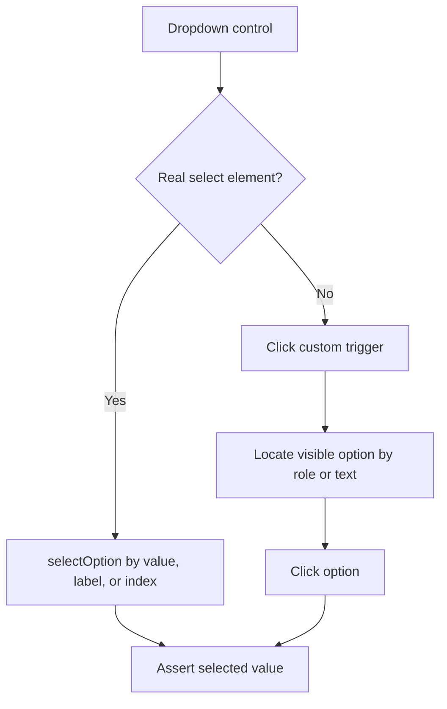

```ts
// Native <select>
await page.goto('https://the-internet.herokuapp.com/dropdown');
await page.locator('#dropdown').selectOption('Option 2');
await expect(page.locator('#dropdown')).toHaveValue('2');

// Custom dropdown: trigger + rendered option
await page.goto('https://app.thetestingacademy.com/playwright/tables/dropdowns');
await page.getByTestId('lang-trigger').click();
await page.getByRole('option', { name: 'JavaScript' }).click();

await page.getByTestId('experience-trigger').click();
await page.getByText('Mid-level (4-6 years)', { exact: true }).click();
```

#### 08.1 - React Select: Single, Multi & Tag-Style Controls

**Concept:** React Select-style widgets render a trigger/input plus a popup menu instead of a native `<select>`. A single-select replaces its current choice, while multi-select and tag-style controls keep each choice as a removable chip. Press `Escape` after multi-selection when you need to dismiss the open menu before moving on.

**Why:** component libraries often generate dynamic class names and nested markup. Stable ids and user-facing text keep the test focused on behavior, while keyboard actions provide a reliable way to dismiss an open menu before continuing.

**Q&A: why use this?**
- **Q: Why use `{ exact: true }` for multi-select options?** A: It prevents a short label such as `JUnit` or `security` from also matching a larger text node that contains the same word.
- **Q: How do I add several options?** A: Keep the multi-select menu open, click each exact option, then press `Escape` when selection is complete.
- **Q: How are existing tags selected?** A: Open the tag-style control and click each exact visible option, just like a multi-select.

```ts
await page.goto('https://app.thetestingacademy.com/playwright/tables/select-boxes');

// Single selection
await page.locator('#rs-single').click();
await page.getByText('Cypress', { exact: true }).click();

// Multiple selections become chips
await page.locator('#rs-multi').click();
await page.getByText('Pytest', { exact: true }).click();
await page.getByText('JUnit', { exact: true }).click();
await page.keyboard.press('Escape');

// Select existing choices in the creatable multi-select
await page.locator('#rs-creatable').click();
await page.getByText('api-testing', { exact: true }).click();
await page.getByText('security', { exact: true }).click();
await page.keyboard.press('Escape');
```

#### 08.2 - Async Search Dropdowns

**Concept:** an async dropdown loads or filters options only after the user types. Fill the component's input, assert that the result menu contains the expected option, and then select it by its accessible role and name.

**Why:** immediately clicking a result races the network/render cycle. A web-first assertion on the menu synchronizes the test with the UI without a hard-coded timeout.

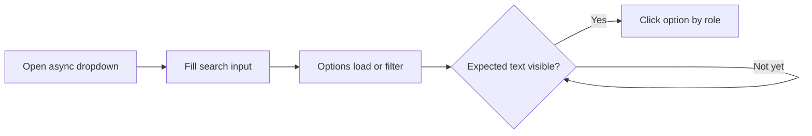

```ts
await page.locator('#rs-async').click();
await page.getByTestId('rs-async-input').fill('pun');

const menu = page.getByTestId('rs-async-menu');
await expect(menu).toContainText('Pune');
await page.getByRole('option', { name: 'Pune' }).click();
```

| Control | DOM pattern | Playwright approach | Covered in |
|:--|:--|:--|:--|
| Native select | `<select>` + `<option>` | `selectOption()` | `259` |
| Custom dropdown | trigger + listbox/options | click trigger, then visible option | `260` |
| React Select single/multi/tag-style | generated input, menu, chips | stable id/text + keyboard | `261` |
| Async select | search input + delayed menu | fill, web-first assert, click option | `261` |

### 09 - Frames & Iframes

**Concept:** an `<iframe>` embeds a separate document with its own DOM, `page.locator()` cannot see inside it. `page.frameLocator(selector)` returns a `FrameLocator` scoped to that document; frames can nest, so a `FrameLocator` can itself call `.frameLocator()` again to drill further down.

**Why:** widgets like payment forms, embedded registration panels, or third-party iframes are literally unreachable from the parent page's locator tree, you have to explicitly step into the frame before any `.fill()`/`.click()` will find the element.

**Q&A — why use this?**
- **Q: How is `frameLocator()` different from the old `page.frame({ name })`?** A: `frameLocator()` is lazy and auto-waits like a normal locator, `page.frame()` grabs a `Frame` handle immediately and throws if the iframe hasn't loaded yet.
- **Q: How do I handle 3 levels of nested iframes?** A: Chain `.frameLocator()` on the result of the previous one: `frame1.frameLocator('#pact2')` returns `frame2`, then `frame2.frameLocator('#pact3')` returns `frame3`.
- **Q: How do I discover unnamed frames on a page?** A: `page.locator('//frame').all()` returns every `<frame>` element, then read `.getAttribute('name')` / `.getAttribute('src')` on each to find the one you need.

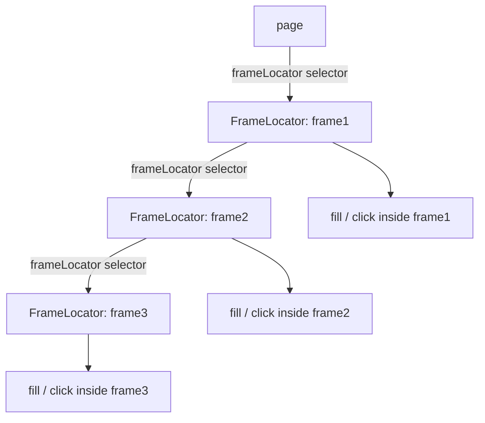

```ts
await page.goto('https://selectorshub.com/iframe-scenario/');

// Step into 3 levels of nested iframes
let frame1 = page.frameLocator('#pact1');
let frame2 = frame1.frameLocator('#pact2');
let frame3 = frame2.frameLocator('#pact3');

await frame1.locator('#inp_val').fill('Aishwarya Rai');
await frame2.locator('#jex').fill('Wife');
await frame3.locator('#glaf').fill('Playwright');

// Enumerate every frame on a multi-frame page
const allFrames = await page.locator('//frame').all();
for (const frame of allFrames) {
    console.log(await frame.getAttribute('name'), ':', await frame.getAttribute('src'));
}
```

### 10 - Keyboard, Hover, Drag & Drop

**Concept:** `page.keyboard` drives real key events (`press`, `down`/`up`, chords like `Control+A`) independent of any element; `locator.hover()` moves the mouse over an element to reveal menus without clicking; `locator.dragTo(target)` performs a full drag-and-drop (mousedown → move → mouseup) between two elements; `locator.click({ button: 'right' })` opens a context menu.

**Why:** hover-to-reveal nav menus, Trello-style drag boards, and right-click menus all depend on real pointer/key sequences, a plain `.click()` cannot reveal a hover submenu or reorder a draggable card.

**Q&A — why use this?**
- **Q: `dragTo()` vs manual `mouse.down()`/`move()`/`up()`?** A: `dragTo()` covers the vast majority of HTML5 drag-and-drop; drop to the manual sequence only when `dragTo()` fails to fire the target's `dragover` handler (some custom drag libraries need the extra intermediate `mouse.move()`).
- **Q: Why does a hover menu need `.hover()` and not `.click()`?** A: The menu item only exists in the DOM (or only becomes clickable) after the trigger element receives a real `mouseover`, `.click()` alone never dispatches that event.
- **Q: How do I read a right-click context menu's options?** A: `click({ button: 'right' })` opens it, then `allInnerTexts()` on the menu items' locator reads every option before clicking one.

```mermaid
flowchart LR
    K[page.keyboard.press] --> A1[key event, no element target]
    H["locator.hover&#40;&#41;"] --> A2[reveals submenu]
    D["source.dragTo&#40;target&#41;"] --> A3[mousedown → move → mouseup]
    R["locator.click&#40;{button:'right'}&#41;"] --> A4[context menu opens]
```

```ts
// Hover to reveal a submenu, then click the revealed item
await page.getByText('Add-ons', { exact: true }).hover();
await page.getByText('FlyEarly', { exact: true }).click();

// Drag and drop between two columns
await page.locator('#column-a').dragTo(page.locator('#column-b'));

// Right-click, read the menu, click an option
await page.locator('span.context-menu-one').first().click({ button: 'right' });
const options = await page.locator('ul.context-menu-list span').allInnerTexts();
await page.getByText('Copy', { exact: true }).first().click();
```

Full keyboard key-name table, mouse API, and every drag-and-drop method (`dragTo`, `page.dragAndDrop`, manual) are in [`tests/10_Keyboard_Hover_Drag_Drop/learning.md`](tests/10_Keyboard_Hover_Drag_Drop/learning.md).

### 11 - JS Alerts (Dialogs)

**Concept:** native browser dialogs (`alert`, `confirm`, `prompt`) block the page, so Playwright surfaces them as a `dialog` event instead of a locator. Register `page.once('dialog', handler)` **before** the action that triggers the dialog, then call `dialog.accept()` / `dialog.accept(text)` / `dialog.dismiss()` inside the handler.

**Why:** if no `dialog` listener is registered, Playwright auto-dismisses the dialog by default, silently discarding any `prompt()` input, so an assertion on the resulting page state fails for a reason that has nothing to do with your locator.

**Q&A — why use this?**
- **Q: Why `page.once` instead of `page.on`?** A: `once` auto-removes the listener after it fires once, which matches a single dialog trigger and avoids a stale handler catching an unrelated later dialog.
- **Q: How do I answer a `prompt()`?** A: `dialog.accept(inputText)`, the string becomes the prompt's return value; `dialog.accept()` with no argument submits the prompt's current default value.
- **Q: What can I assert on the dialog itself?** A: `dialog.type()` (`'alert' | 'confirm' | 'prompt'`), `dialog.message()`, and for prompts, `dialog.defaultValue()`, all readable before you `accept()`/`dismiss()`.

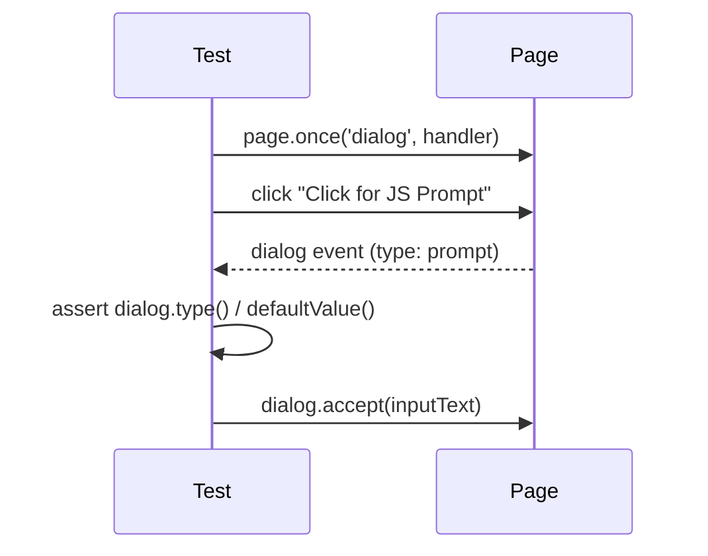

```ts
const inputText = 'Hello from The Testing Academy';

// Register the handler BEFORE the action that opens the dialog
page.once('dialog', async dialog => {
    expect(dialog.type()).toBe('prompt');
    expect(dialog.defaultValue()).toBe('');
    await dialog.accept(inputText);
});

await page.locator('button', { hasText: 'Click for JS Prompt' }).click();
```

## Configuration Highlights

Defined in `playwright.config.ts`:

- `testDir: './tests'` — where specs live
- `testMatch: ['tests/**/*.spec.ts']` — recurses into every numbered module folder
- `fullyParallel: true` — run test files in parallel
- `reporter: [["line"], ["./utils/CustomReporter.ts"]]` — terminal progress + the custom TTA HTML report (module 05)
- `trace: 'on'`, `screenshot: 'on'`, `video: 'on'` — full debug artifacts for every run (heavier, dial back for CI)
- `headless: false`, `viewport: null` + `launchOptions.args: ['--start-maximized']` — browser opens maximized to the real screen size instead of a fixed viewport
- Projects: Chromium active; Firefox and WebKit currently commented out
- CI-aware retries and workers (`process.env.CI`)

## Learn More

- [Playwright Docs](https://playwright.dev/docs/intro)
- [The Testing Academy](https://thetestingacademy.com/)

## License

ISC
